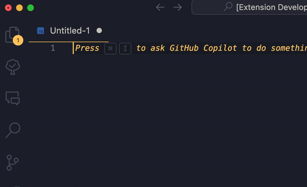

# console log here!~

[Inspired by fellow debuggers 🥲](https://www.linkedin.com/feed/update/urn:li:activity:7225041654804615168/?commentUrn=urn%3Ali%3Acomment%3A(activity%3A7225041654804615168%2C7225049174138875904)&dashCommentUrn=urn%3Ali%3Afsd_comment%3A(7225049174138875904%2Curn%3Ali%3Aactivity%3A7225041654804615168))

- For minimal effort debugging.

- There are just 2 code snippets, `lh` and `lhv`.

---

**Relax!**
